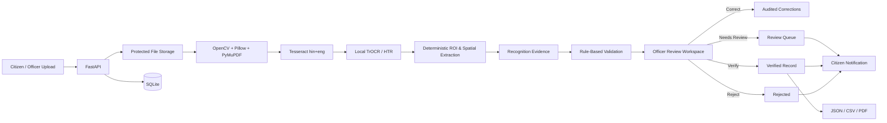

# BhumiAI — Evidence-First Land Record Digitization

**Smart India Hackathon 2026 • PS26018**

BhumiAI is a human-in-the-loop land-record digitization prototype focused on Hindi/English Khatauni documents. It converts uploaded scans/images/PDFs into structured records, exposes recognition evidence and rule-based validation to an authorized officer, preserves every correction in an audit trail, and creates a verified digital record only after officer approval.

> **Core principle:** recognition assists the officer; it does not make autonomous legal decisions.

## Why BhumiAI

Land-record digitization is difficult because source documents can contain low-quality scans, Hindi text, handwriting, dense tables, inconsistent layouts, and legally important numbers. A conventional OCR-only workflow can silently turn recognition errors into database errors.

BhumiAI instead keeps the original evidence visible throughout review:

```text
Citizen Upload
    ↓
Image/PDF Preparation
    ↓
Tesseract OCR + Local TrOCR/HTR
    ↓
Deterministic Field & Table Extraction
    ↓
Recognition Evidence
    ↓
Rule-Based Validation
    ↓
Officer Source-vs-Record Review
    ↓
Correction / Needs Review / Verify / Reject
    ↓
Verified Record + Audit Trail + In-App Notification
    ↓
JSON / CSV / PDF Export
```

## Architecture



## Current Workflow

**Citizen**
- Phone-OTP registration/login.
- Profile completion before workspace access.
- Upload image, scan, or PDF.
- Submit record for officer review.
- Track status and receive in-app notifications.
- Access/export owned verified records.

**Officer**
- Authority-provisioned Officer ID + password.
- Review queue and dashboard.
- Open the original/enhanced source beside the structured record.
- Run preprocessing, OCR and extraction only when required.
- Correct extracted fields and Khatauni table cells.
- Optional deterministic Roman-to-Devanagari typing aid for textual corrections.
- Mark **Needs Review**, **Verify**, or **Reject**.
- Review exact-file duplicate evidence before deciding.

## Processing Stages

The Officer Review UI uses the compact workflow:

```text
Upload → Enhance → Recognize → Extract → Review → Verified
```

| Stage | Implementation |
| --- | --- |
| Upload | FastAPI multipart upload, file-size checks, UUID-backed storage |
| Enhance | OpenCV + Pillow preprocessing |
| Recognize | Tesseract 5.4 `hin+eng` with local TrOCR/HTR for selected uncertain handwritten regions |
| Extract | Deterministic ROI/spatial mapping into fields and Khatauni table cells |
| Review | Source-vs-structured officer workspace with corrections and audit |
| Verified | Authenticated verified record with export support |

## Recognition Evidence

BhumiAI does **not** present raw OCR confidence as a legal probability.

Recognition evidence is derived from deterministic signals such as recognizer output, repeated-pass stability, cross-engine agreement, text quality and limited validation support.

Current evidence bands:

- **HIGH**: 85–98
- **MEDIUM**: 65–84
- **LOW**: below 65

Validation remains separate:

- **PASS**
- **NEEDS REVIEW**
- **UNRESOLVED**

This separation helps the officer distinguish “how strong was the recognition evidence?” from “does this value satisfy known deterministic rules?”

## Exact Duplicate Detection

Uploaded files are hashed with SHA-256.

- Same file bytes under a different filename → detected as an exact duplicate.
- A rescanned, recompressed, cropped or visually similar document may produce a different hash.

Therefore the feature is intentionally described as **exact-document duplicate detection**, not visual-similarity detection. The system never auto-rejects: the officer can continue review or reject a verified exact match as a duplicate.

## Human-in-the-Loop Verification

The officer workspace is the core of BhumiAI:

- source document and structured record side-by-side
- original/enhanced preview
- confidence and validation shown independently
- edited indicators with OCR context
- unsaved-change warning
- deterministic Hindi phonetic correction mode for textual fields
- compact Khatauni table review
- confirmation before final decisions
- verified/rejected records become read-only
- important corrections and decisions are persisted in audit/provenance logs

No generative model is used to invent, translate, autocorrect or legally decide land-record values.

## Notifications

Citizens receive persisted **in-app** notifications for:

- submission marked **Needs Review**
- submission **Verified**
- submission **Rejected**
- duplicate-review outcome
- exact-match notice to the owner of the existing verified record where applicable

This is currently an in-app notification system, not SMS/email/push delivery.

## Security and Integrity

Current prototype protections include:

- opaque server-side sessions
- HttpOnly session cookie
- role-based citizen/officer guards
- active-citizen profile checks
- officer accounts provisioned server-side
- authenticated document-content endpoint
- ownership checks for citizen records
- UUID storage names
- configurable upload-size limit
- production auth-secret validation
- terminal-state immutability for verified/rejected records
- audit/provenance entries for key operations

## Technology Stack

| Layer | Technology |
| --- | --- |
| Frontend | Next.js App Router, React, JavaScript/JSX, custom CSS, Lucide |
| Backend API | Python, FastAPI, Uvicorn, Pydantic |
| Persistence | SQLAlchemy + SQLite (prototype) |
| Image processing | OpenCV, Pillow |
| PDF rendering | PyMuPDF |
| OCR | Tesseract via pytesseract, `hin+eng` |
| Handwriting recognition | Local TrOCR/Transformers + PyTorch |
| Similarity/helpers | RapidFuzz + deterministic Python logic |
| Export | JSON, CSV, PDF |
| Authentication | Phone OTP for citizens, Officer ID/password for officers, opaque cookie sessions |

## Repository Structure

```text
BhumiAi/
├── backend/
│   ├── main.py
│   ├── database.py
│   ├── models.py
│   ├── schemas.py
│   ├── security.py
│   ├── digitization.py
│   ├── khatauni_fast.py
│   ├── khatauni_hybrid.py
│   ├── khatauni_structured.py
│   ├── khatauni_extractor.py
│   ├── routers/
│   ├── services/
│   ├── scripts/
│   └── tests/
├── frontend/
│   ├── src/app/
│   ├── src/components/
│   └── src/lib/
├── docs/
│   └── SIH_DEMO_GUIDE.md
└── README.md
```

## Local Setup

### 1. Backend

Create a virtual environment and install the pinned dependencies:

```powershell
cd backend
python -m venv .venv
.\.venv\Scripts\Activate.ps1
python -m pip install -r requirements.txt
Copy-Item .env.example .env
```

Install native Tesseract with both **Hindi** and **English** trained data, then set `TESSERACT_CMD` in `backend/.env`.

Start the API:

```powershell
python -m uvicorn main:app --reload --host 127.0.0.1 --port 8000
```

### 2. Local HTR model

BhumiAI does not download model weights during an extraction request. The TrOCR model must already be available locally.

To pre-cache the default model once:

```powershell
cd backend
python -c "from huggingface_hub import snapshot_download; snapshot_download('aayushpuri01/TrOCR-Devanagari', cache_dir='models')"
```

The runtime then loads it with local-only access. To intentionally run OCR without HTR, set:

```env
KHATAUNI_ENABLE_HTR=0
```

Do **not** commit downloaded model weights.

### 3. Frontend

```powershell
cd frontend
npm install
npm run dev
```

Open:

- Frontend: `http://127.0.0.1:3000`
- Backend: `http://127.0.0.1:8000`
- API docs: `http://127.0.0.1:8000/docs`

## Authentication Notes

- Citizen authentication is phone-OTP based.
- Development mode can return the OTP in the API response for local testing.
- Production mode intentionally refuses that behavior.
- A real production SMS provider is **not** bundled with this prototype.
- Officer registration is not public; development credentials are provisioned through environment variables.

## Testing

Backend:

```powershell
cd backend
python -m pytest tests -q
```

Frontend production build:

```powershell
cd frontend
npm run build
```

## Current Prototype Limitations

BhumiAI deliberately keeps claims within what the repository implements today:

- Hindi + English are the validated recognition languages.
- PDF recognition currently rasterizes **page 1** for processing.
- SQLite and local filesystem storage are prototype choices.
- Production SMS/identity-provider integration is not included.
- Exact duplicate detection is byte-level SHA-256, not visual similarity.
- No live LRMS/DILRMP/GIS/cadastral integration is claimed.
- No automated legal ownership determination is performed.
- No autonomous learning/retraining loop is enabled from officer corrections.
- No GenAI, LLM, RAG, embeddings or generative correction is used in the land-record pipeline.

## Production Evolution

A production deployment can retain the same evidence-first workflow while replacing prototype infrastructure with:

- PostgreSQL
- managed/object storage
- background OCR workers
- production SMS/identity integration
- monitoring and observability
- controlled multi-language models
- multi-page document orchestration
- authorized LRMS/DILRMP/GIS adapters

These are future deployment steps, not current implemented claims.

## SIH Demo

A concise demo and judge-facing claim guide is available in:

**[docs/SIH_DEMO_GUIDE.md](docs/SIH_DEMO_GUIDE.md)**

---

**BhumiAI — digitize the record, preserve the evidence, keep the officer in control.**
