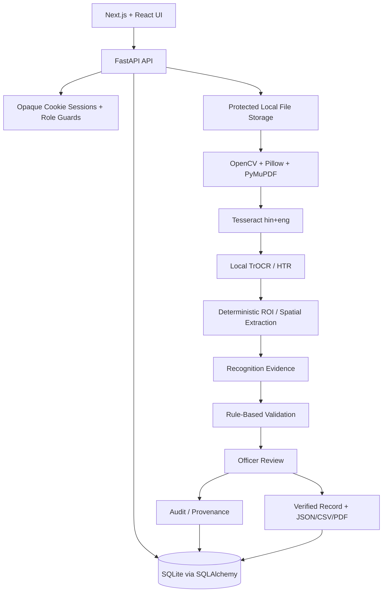

# BhumiAI — Current Application Notes

**Updated: 25 September 2026**

This document describes the **current implementation on `main`**. It replaces older notes that referenced Google OAuth, citizen email/password login, the old `backend/app/` layout, or other retired experiments.

The source of truth is the active code under `backend/` and `frontend/`.

## 1. Purpose

BhumiAI is an evidence-first land-record digitization and verification prototype for **SIH 2026 • PS26018**.

The currently validated workflow is focused on Hindi/English **Khatauni-style** land records:

```text
Citizen/Officer Upload
    ↓
Secure source storage
    ↓
OpenCV/Pillow preprocessing
    ↓
Tesseract hin+eng + optional local TrOCR/HTR
    ↓
Deterministic field/table extraction
    ↓
Recognition Evidence
    ↓
Rule-based validation
    ↓
Officer correction and decision
    ↓
Verified / Needs Review / Rejected
    ↓
Audit + notification + verified-only exports
```

BhumiAI does not autonomously determine land ownership or replace an authorized government officer.

## 2. Roles and Authentication

### Citizen / Record Submitter

Current citizen authentication is **phone OTP**, not Google OAuth or citizen password login.

Flow:

```text
Choose Register/Login
→ Request phone OTP
→ Verify OTP
→ Complete profile
→ Access citizen workspace
```

Development mode may return the OTP in the API response for local testing. Production mode is designed to require a configured delivery provider.

### Officer

Officers do not self-register.

An officer account is provisioned server-side with:

- Government Officer ID
- email
- display name
- password

The officer signs in with the issued Officer ID/password.

## 3. Current Architecture



## 4. Active Technology Map

| Area | Current implementation |
| --- | --- |
| Frontend | Next.js App Router, React, JavaScript/JSX, custom CSS |
| Backend | Python, FastAPI, Uvicorn, Pydantic |
| ORM / DB | SQLAlchemy + SQLite |
| Uploads | FastAPI multipart + UUID filenames + size checks |
| Image preparation | OpenCV + Pillow |
| PDF rasterization | PyMuPDF |
| OCR | Tesseract through pytesseract, `hin+eng` |
| Handwriting support | Local TrOCR/Transformers + PyTorch |
| Extraction | Deterministic ROI/spatial rules and Khatauni schema logic |
| Confidence | Recognition Evidence derived from deterministic signals |
| Validation | Separate rule-based PASS / NEEDS REVIEW / UNRESOLVED state |
| Duplicate detection | SHA-256 exact-file matching |
| Auth | Phone OTP for citizens; Officer ID/password for officers |
| Session | Opaque random server-side session + HttpOnly cookie |
| Export | Verified-only JSON, CSV and PDF |
| Notifications | Persisted in-app citizen notifications |

## 5. Active Repository Structure

```text
BhumiAi/
├── backend/
│   ├── main.py
│   ├── config.py
│   ├── database.py
│   ├── models.py
│   ├── schemas.py
│   ├── security.py
│   ├── digitization.py
│   ├── khatauni_extractor.py
│   ├── khatauni_fast.py
│   ├── khatauni_hybrid.py
│   ├── khatauni_schema.py
│   ├── khatauni_structured.py
│   ├── routers/
│   │   ├── auth.py
│   │   ├── documents.py
│   │   ├── officer.py
│   │   ├── records.py
│   │   └── users.py
│   ├── services/
│   ├── scripts/
│   └── tests/
├── frontend/
│   ├── src/app/
│   ├── src/components/
│   └── src/lib/
├── docs/
└── README.md
```

## 6. Document Processing

### 6.1 Upload

Accepted source types are currently PDF, JPG, JPEG and PNG.

The backend:

- validates the extension
- streams the upload instead of base64-encoding it
- enforces a configurable maximum size
- rejects empty files
- stores the file under a generated UUID filename
- calculates SHA-256
- persists the document/submission transactionally

### 6.2 Enhance

OpenCV/Pillow preprocessing is used to make the source more OCR-friendly. The source evidence is not overwritten.

### 6.3 Recognize

Tesseract performs Hindi/English OCR and returns text, confidence and spatial token information.

The optional TrOCR path is used locally for selected handwriting candidates. It does not send document images to a hosted generative service.

### 6.4 Extract

Khatauni field/table extraction is deterministic. Values come from recognized source regions; the system does not use an LLM to infer missing legal values.

### 6.5 Recognition Evidence

Recognition Evidence is not a probability of legal correctness.

Current display bands:

- HIGH: 85–98
- MEDIUM: 65–84
- LOW: below 65

Validation is separate:

- PASS
- NEEDS REVIEW
- UNRESOLVED

### 6.6 Officer Review

The officer compares the source document and structured record side-by-side.

The current workflow includes:

- Original / Enhanced source view
- Fit/zoom controls
- grouped extracted fields
- editable Khatauni table
- confidence + validation indicators
- deterministic EN/Hindi phonetic typing mode for textual corrections
- edited markers
- unsaved-change protection
- Save Corrections
- Needs Review
- Verify
- Reject
- final-action confirmation
- read-only terminal VERIFIED/REJECTED records

## 7. Duplicate Handling

BhumiAI uses **exact SHA-256 file matching**.

Changing only the filename does not bypass detection because the hash is based on file bytes.

A re-scan, crop, recompression or visually similar image can have different bytes and therefore a different hash.

Duplicate detection is decision support:

- no automatic rejection
- officer can continue review
- a verified exact match can be rejected using the Duplicate Submission reason
- duplicate outcomes are audited
- relevant citizen notifications are created

## 8. Notifications

The current in-app notification workflow includes:

- `SUBMISSION_NEEDS_REVIEW`
- `SUBMISSION_VERIFIED`
- `SUBMISSION_REJECTED`
- `DUPLICATE_SUBMISSION_REVIEWED`
- `EXACT_DUPLICATE_NOTICE`

Citizens can fetch their own notifications and mark them as read.

This is currently **in-app delivery**. Production SMS/email/push delivery is not claimed.

## 9. Verified Records and Exports

Only verified records are exportable.

Supported formats:

- JSON
- CSV
- PDF

The export layer uses a canonical verified-record representation. CSV output includes spreadsheet formula-injection protection, while PDF export supports Devanagari when an appropriate system/configured font is available.

## 10. Security and Integrity

Current controls include:

- opaque session tokens
- hashed server-side session token storage
- HttpOnly cookies
- Secure cookie in production mode
- citizen/officer role guards
- active-citizen profile guard
- authenticated document content route
- citizen ownership checks
- no public officer registration
- production auth-secret validation
- terminal-record immutability
- audit/provenance for important workflow actions
- private runtime upload/storage directories excluded from Git

## 11. Tesseract Setup

Install native Tesseract with both English and Hindi trained data.

Example Windows configuration in `backend/.env`:

```env
TESSERACT_CMD=C:\Program Files\Tesseract-OCR\tesseract.exe
TESSERACT_LANGUAGES=hin+eng
```

Verify:

```powershell
& "C:\Program Files\Tesseract-OCR\tesseract.exe" --version
& "C:\Program Files\Tesseract-OCR\tesseract.exe" --list-langs
```

The language list should include:

```text
eng
hin
```

## 12. Local TrOCR / HTR Setup

Runtime recognition is local-only. Model weights are intentionally excluded from Git.

Pre-cache the default model once:

```powershell
cd backend
python -c "from huggingface_hub import snapshot_download; snapshot_download('aayushpuri01/TrOCR-Devanagari', cache_dir='models')"
```

Relevant environment values:

```env
KHATAUNI_ENABLE_HTR=1
KHATAUNI_HTR_MODEL=aayushpuri01/TrOCR-Devanagari
KHATAUNI_HTR_MAX_CROPS=4
```

During extraction the runtime uses local-only model loading. If the model is unavailable, the HTR path reports itself unavailable instead of silently uploading document data.

To intentionally disable HTR:

```env
KHATAUNI_ENABLE_HTR=0
```

## 13. Local Run

Backend:

```powershell
cd backend
python -m venv .venv
.\.venv\Scripts\Activate.ps1
python -m pip install -r requirements.txt
Copy-Item .env.example .env
python -m uvicorn main:app --reload --host 127.0.0.1 --port 8000
```

Frontend:

```powershell
cd frontend
npm install
npm run dev
```

Default development URLs:

- UI: `http://127.0.0.1:3000`
- API: `http://127.0.0.1:8000`
- Swagger: `http://127.0.0.1:8000/docs`

## 14. Tests

Backend:

```powershell
cd backend
python -m pytest tests -q
```

Frontend:

```powershell
cd frontend
npm run build
```

## 15. Current Limitations

These are deliberate scope boundaries of the current prototype:

1. The validated document workflow is Khatauni-focused rather than universal across every land-record format.
2. Recognition languages currently target Hindi + English.
3. PDF recognition currently processes the first page.
4. Exact duplicate detection is byte-level, not visual similarity.
5. SQLite and local filesystem storage are prototype infrastructure.
6. A production SMS/identity delivery provider is not integrated.
7. Camera behavior still requires real-device/browser testing for production confidence.
8. Recognition Evidence is a deterministic heuristic score, not a calibrated probability.
9. There is no live LRMS/DILRMP/GIS/cadastral integration.
10. There is no autonomous learning/retraining loop from officer corrections.
11. There is no GenAI/LLM/RAG/embedding-based legal correction or semantic guessing.
12. The system does not independently establish legal ownership.

## 16. Production Evolution

A production version can retain the same verification model while moving to:

```text
SQLite             → PostgreSQL
Local filesystem   → private object storage
Single process     → background recognition workers
Development OTP    → approved SMS/identity provider
Single-page flow   → multi-page orchestration
Hindi/English      → controlled multilingual expansion
Local validation   → authorized LRMS/GIS/cadastral adapters
```

These are **future deployment directions**, not current implemented claims.

## 17. Retired / Non-Current Directions

The following should not be described as part of the current BhumiAI architecture:

- Google citizen login
- citizen email/password login
- PaddleOCR
- PP-StructureV3
- Devanagari PP-OCR
- GenAI / LLM / RAG / embeddings
- autonomous legal decisions
- PostgreSQL as the current database
- fake government/GIS integrations

For judge-facing documentation, use the root `README.md` and `docs/SIH_DEMO_GUIDE.md`.
